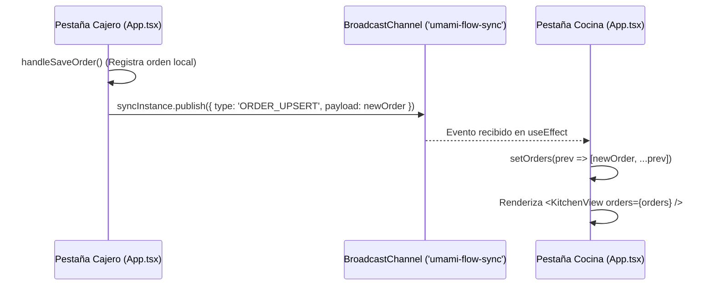
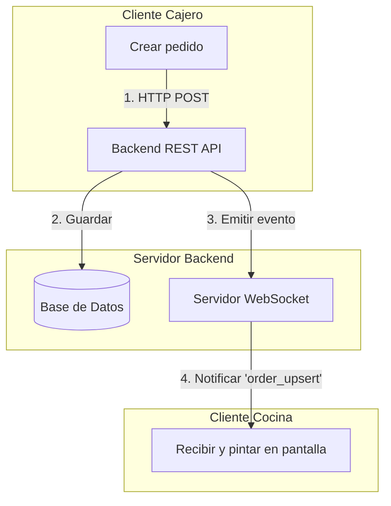

# Guía de Sincronización en Tiempo Real: Análisis y Migración a WebSockets

Este documento resume el análisis realizado sobre los errores detectados en la pantalla de cocina (`KitchenView`), describe el flujo de sincronización local actual mediante `BroadcastChannel` y presenta una guía arquitectónica para migrar hacia un backend híbrido usando **HTTP REST + WebSockets**.

---

## 1. Análisis del Error en la Pantalla de Cocina

### El Problema
Al duplicar y refactorizar [KitchenView.tsx](file:///home/equis/Universidad/Proyectos/Restaurante/frontend/src/components/KitchenView.tsx) en la nueva carpeta [src/components/kitchen](file:///home/equis/Universidad/Proyectos/Restaurante/frontend/src/components/kitchen), se introdujeron dos fallos de React:

1. **Llamada a componentes como funciones comunes (Violación de las reglas de Hooks):**
   En [kitchenView.tsx](file:///home/equis/Universidad/Proyectos/Restaurante/frontend/src/components/kitchen/kitchenView.tsx#L83), el componente `OrdersPend` se renderiza invocándolo directamente como función en lugar de usar sintaxis JSX:
   ```tsx
   {activeOrders.length > 0 ? (
     OrdersPend({ activeOrders, onUpdateStatus }) // ❌ Llamada de función
   ) : (
     <div style={styles.emptyCardContainer}>...</div>
   )}
   ```
   Como `OrdersPend` contiene hooks (`useKitchenState`), React registra estos hooks en la cola del padre (`KitchenView`). Cuando la condición cambia (por ejemplo, al completar la última comanda y quedar `activeOrders.length` en `0`, o al cambiar de pestaña a Inventario), la función no se ejecuta y React detecta que se ejecutaron menos hooks que antes. Esto provoca el error crítico: **`Rendered fewer hooks than expected`**.

2. **Duplicación de estados con `useKitchenState`:**
   Tanto en `KitchenView` como en `OrdersPend` se invoca `useKitchenState()`. Esto inicializa copias independientes y redundantes del estado global de cocina (como `activeTab` y `selectedOrderDetails`), lo que rompe la sincronización lógica del modal de detalles.

### La Solución Recomendada
* **Paso A:** Renderizar `OrdersPend` como componente JSX para que React gestione sus hooks de forma aislada y limpia durante los desmontajes condicionales:
  ```tsx
  <OrdersPend activeOrders={activeOrders} onUpdateStatus={onUpdateStatus} />
  ```
* **Paso B:** En lugar de llamar al hook compartido `useKitchenState()` dentro de `OrdersPend`, declara un estado local con un hook simple para controlar el modal:
  ```tsx
  const [selectedOrderDetails, setSelectedOrderDetails] = useState<Order | null>(null);
  ```

---

## 2. Flujo de Datos Actual (Sincronización Local)

Actualmente, el cajero y la cocina se sincronizan localmente en tiempo real a través del navegador:



* **Vehículo de transmisión:** El archivo [sync.ts](file:///home/equis/Universidad/Proyectos/Restaurante/frontend/src/utils/sync.ts) instancia la API del navegador `BroadcastChannel`. 
* **Limitación:** Este flujo es **100% local**. Si el cajero y la cocina se abren en diferentes dispositivos (computadoras/tablets), no se comunicarán entre sí.

---

## 3. Propuesta de Migración: Modelo Híbrido (REST + WebSockets)

Para permitir que el sistema funcione en múltiples dispositivos y mantenga una base de datos centralizada, la arquitectura híbrida es la mejor opción.

### Flujo de la Arquitectura Híbrida

1. **Mutaciones de Estado (Escribir):** Se realizan mediante peticiones estándar **HTTP REST** (`POST`, `PUT`, `PATCH`, `DELETE`).
2. **Suscripción en Tiempo Real (Leer):** Se realiza abriendo una conexión persistente por **WebSockets** (ej. usando Socket.io) para recibir las alertas cuando ocurran cambios en el servidor.



### Guía de Implementación en el Frontend

#### Paso 1: Configurar el cliente de sockets (`src/utils/socket.ts`)
Reemplaza el uso de `sync.ts` por una inicialización del cliente de WebSocket:
```typescript
import { io } from 'socket.io-client';

const SOCKET_URL = import.meta.env.VITE_API_URL || 'http://localhost:3000';

export const socket = io(SOCKET_URL, {
  autoConnect: true,
  transports: ['websocket'],
});
```

#### Paso 2: Escuchar actualizaciones en `App.tsx`
Sustituye la suscripción local por escuchadores de WebSocket que actualicen la interfaz en tiempo real:
```typescript
import { socket } from './utils/socket';

useEffect(() => {
  // Escuchar cuando el servidor nos notifica una orden creada/modificada
  socket.on('order_upsert', (updatedOrder: Order) => {
    setOrders((prevOrders) => {
      const index = prevOrders.findIndex((o) => o.id === updatedOrder.id);
      if (index > -1) {
        // Alerta opcional de cambio de estado
        return prevOrders.map(o => o.id === updatedOrder.id ? updatedOrder : o);
      } else {
        return [updatedOrder, ...prevOrders];
      }
    });
  });

  socket.on('order_delete', (idToDelete: string) => {
    setOrders((prevOrders) => prevOrders.filter((o) => o.id !== idToDelete));
  });

  return () => {
    socket.off('order_upsert');
    socket.off('order_delete');
  };
}, []);
```

#### Paso 3: Enviar cambios al Servidor vía HTTP
En lugar de mutar el estado local directamente y usar el canal local, realiza llamadas API:

* **Desde el Cajero (Registrar Pedido):**
  ```typescript
  const handleSaveOrder = async (orderData: Partial<Order>) => {
    try {
      const response = await fetch('/api/orders', {
        method: 'POST',
        headers: { 'Content-Type': 'application/json' },
        body: JSON.stringify(orderData),
      });
      const savedOrder = await response.json();
      setOrders(prev => [savedOrder, ...prev]);
    } catch (error) {
      console.error("Error guardando el pedido:", error);
    }
  };
  ```

* **Desde la Cocina (Cambiar Estado del Pedido):**
  ```typescript
  const handleUpdateStatus = async (id: string, status: OrderStatus) => {
    try {
      await fetch(`/api/orders/${id}/status`, {
        method: 'PATCH',
        headers: { 'Content-Type': 'application/json' },
        body: JSON.stringify({ status }),
      });
    } catch (error) {
      console.error("Error actualizando estado:", error);
    }
  };
  ```

---

## 4. Rol del Backend en el Modelo Híbrido

En el backend, cada vez que un endpoint HTTP modifica el estado del restaurante, se debe notificar a los WebSockets. Ejemplo en Node.js/Express:

```javascript
// Endpoint HTTP PATCH para cambiar el estado de la comanda
app.patch('/api/orders/:id/status', async (req, res) => {
  const { id } = req.params;
  const { status } = req.body;

  // 1. Guardar en Base de Datos
  const updatedOrder = await db.order.update(id, { status, updatedAt: new Date() });

  // 2. Transmitir el cambio a todos los WebSockets conectados
  io.emit('order_upsert', updatedOrder);

  // 3. Responder al cliente HTTP
  res.json(updatedOrder);
});
```
